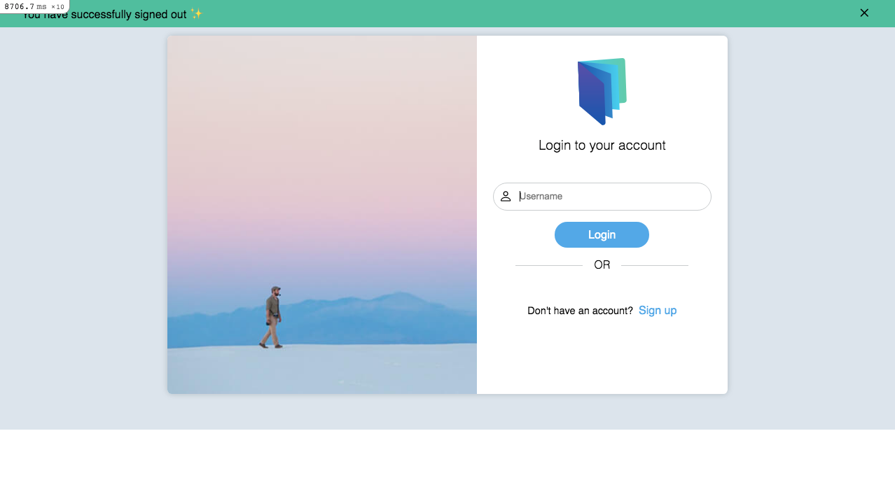
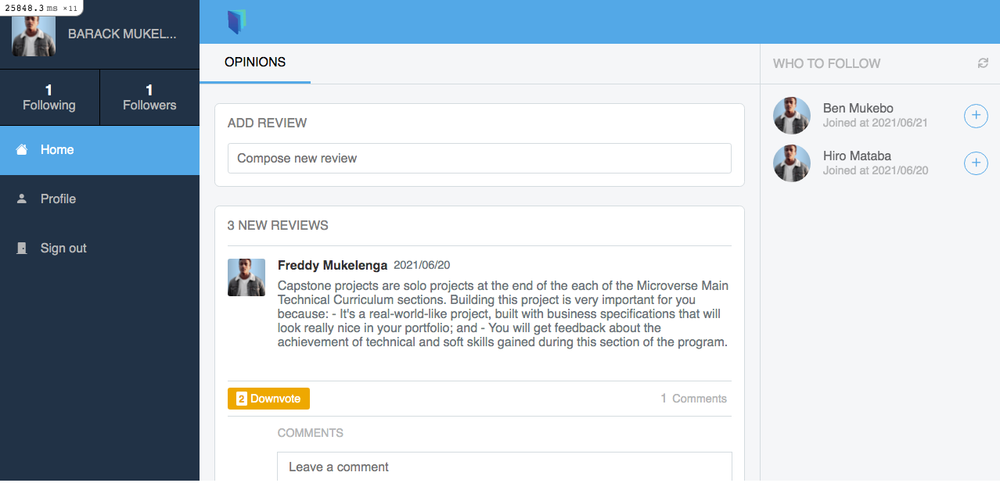
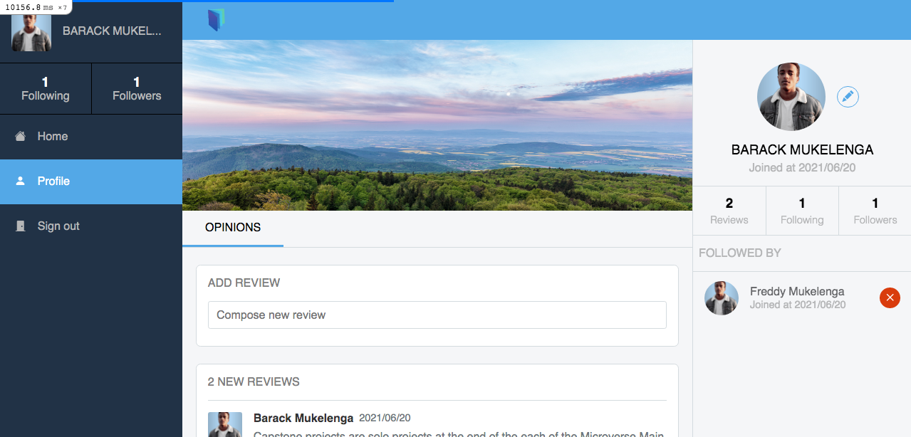
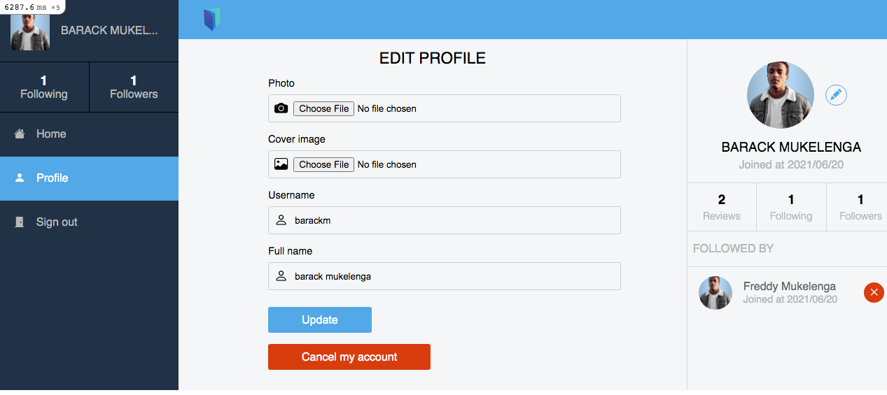

# Project: Book Reviewer

> This project is a Ruby on Rails capstone project based on a redesign of Twitter. It is a place where people can share opinions or reviews about books with people who follow them. Reviews can be commented on and voted on so that other users may be confident about posted reviews.

## Screenshots

## Live demo

You can visit the deployed version of the app via [this link](https://b-book-reviewer.herokuapp.com/sessions/new)

## Built With

- Ruby on rails

## Getting Started

To get a local copy up and running follow these simple example steps:

- Clone the repository as indicated by Setup section below

### Prerequisites

- Text editor
- GitHub
- Git
- ruby
- ruby on rails

### Setup

Clone repository from github to your local drive by following these steps:

- Go to the main page of the repository
- Above the listed files, click the green Code button
- You can clone the repository using:
  - GitHub CLI: gh repo `$ git clone github.com/barackm/book-opinions `.
  - SSH:`$ git clone git@github.com:barackm/book-opinions.git`.
  - HTTPS:`$ git clone https://github.com/barackm/book-opinions `.
- Open Terminal
- Change the current working directory to the location you want the cloned directory
- Type one of the git clone commands listed above.
- Press Enter to create your local clone
- Open your terminal and type <code>rails s</code>. After that join to localhost at http://localhost:3000/
- Remember: Yarn packages need to be installed by running the command <code>yarn install</code> for local setup. Otherwise, the app generates an error.
- Create a database by typing in the terminal <code>rails db:create</code> and then <code>rails db:migrate</code> to define changes to your database schema
- Feel free to sign up or sign in and start posting!

### Install

- Install Atom or Microsoft Visual Studio text editor to view the code on your local machine.
- Install Git.
- Install ruby
- Install ruby on rails

### Tests

- This project includes unit tests and integration tests, to run the tests you will just need to run the following command in the terminal from the root of the project
  `$ rails db:migrate RAILS_ENV=test`
  `$ rspec --format documentation`

## Author

👤 **Barack Mukelenga**

- GitHub: [@barackm](https://github.com/barackm)
- Twitter: [@BarackMukelenga](https://twitter.com/BarackMukelenga)
- LinkedIn: [Barack Mukelenga](https://www.linkedin.com/in/baraka-mukelenga/)

## Contributing

Contributions, [issues](https://github.com/barackm/book-opinions/issues), and feature requests are welcome!

## Show your support

Give a ⭐️ if you like this project!

## Acknowledgments

- Microverse
- [Gregoire Vella](https://www.behance.net/gregoirevella) for the design inspiration.
